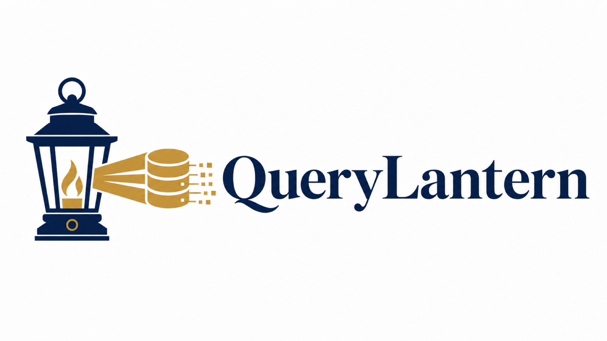
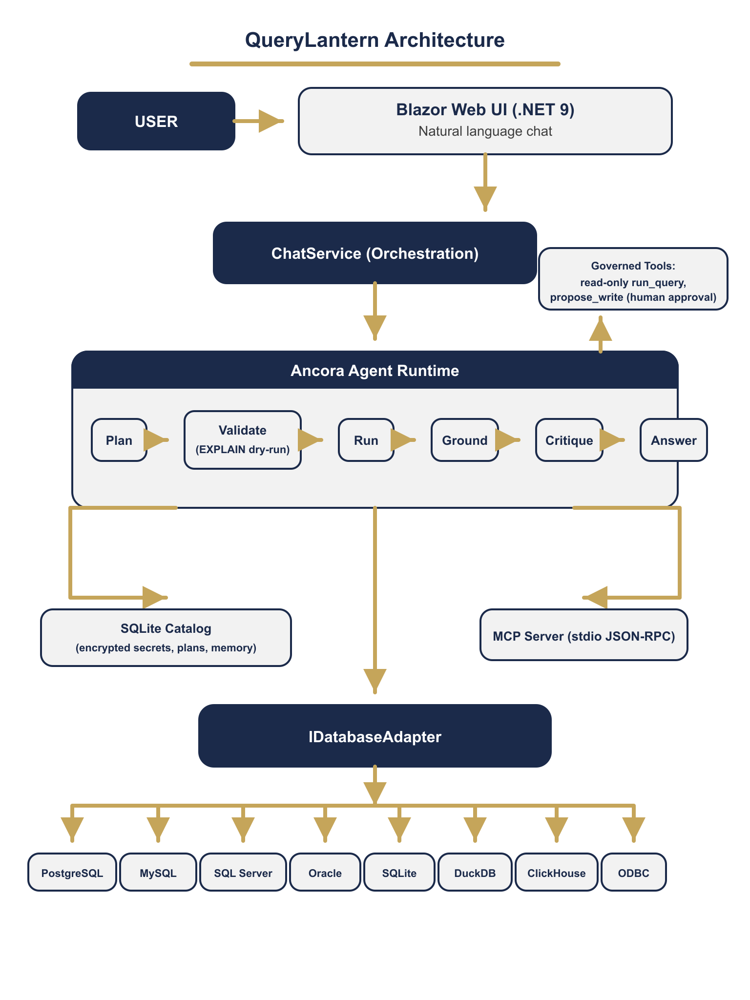

<div align="center">



<br/>

**Chat with your relational databases in natural language. Reads run, writes wait.**

<br/>


</div>

---

## Overview

**QueryLantern** is an open source conversational SQL and data analyst agent. You chat with your
relational databases in natural language. The agent inspects the schema, drafts SQL, executes
read-only queries through a governed tool, streams its interpretation token by token, and renders
charts from the result set. Any statement that writes or changes structure is blocked at the tool
boundary and requires explicit human approval before it runs.

QueryLantern is the flagship showcase of the **Ancora** agentic framework. Every major Ancora
capability is exercised as a first-class product feature: streaming events, delegate and attribute
tools, human-in-the-loop resume, journaled activities, Ed25519 identity, cost summaries, local-first
defaults, and multi-provider model routing.

---

## Architecture

<div align="center">

</div>

| Layer | Technology |
|---|---|
| **UI** | Blazor (interactive Server render mode, .NET 9), one project, component driven |
| **Agent core** | `Yasserrmd.Ancora` (>= 0.1.2). Native libraries ship in the package |
| **Data access** | ADO.NET provider abstraction behind a per-engine `IDatabaseAdapter`. No heavyweight ORM |
| **Charts** | Dependency-free Blazor component that renders result sets as tables and bar charts |
| **Config store** | Local SQLite catalog for saved connections and provider profiles (secrets encrypted at rest) |
| **Target framework** | `net9.0` |

### Database engines

PostgreSQL, MySQL / MariaDB, Microsoft SQL Server, Oracle Database (12c and later), SQLite,
DuckDB, ClickHouse, and a generic ODBC fallback. Each engine sits behind `IDatabaseAdapter`.

### LLM providers

Runtime-configurable OpenAI-compatible provider profiles: **Novita, OpenRouter, OpenAI, Azure OpenAI,
local vLLM, local Ollama, NVIDIA NIM**, and a generic custom endpoint. The agent model is chosen per
conversation from a saved profile.

---

## Run instructions

```bash
dotnet run --project QueryLantern
```

Then open the printed localhost URL. Use the **Connections** page to add a database, the **Providers**
page to add an OpenAI-compatible model profile, then start a chat.

### Quick start (fully local)

1. Install [.NET 9 SDK](https://dotnet.microsoft.com/download).
2. `dotnet run --project QueryLantern`
3. On the **Providers** page, add an `Ollama` or `vLLM` profile pointing at a local model endpoint
   (e.g. `http://localhost:11434/v1`). Local-first mode is on by default and blocks external hosts.
4. On the **Connections** page, add a SQLite file or any supported engine.
5. Open **Chat**, pick the connection and provider, and ask a question.

See [docs/quickstart.md](docs/quickstart.md) for a worked example and a sample database.

---

## Security model

- **Reads run, writes wait.** `run_query` rejects any non-read statement. `propose_write` stages a
  mutating statement and suspends the run; it executes only after you approve it in the UI.
- **Secrets never persisted in plaintext.** Passwords and API keys are encrypted with AES-GCM in a
  local vault; the catalog stores only opaque references.
- **Tamper-evident activity journal.** Every query and every write decision is appended to an
  Ed25519-signed, chained journal. Any modification of history invalidates the chain.
- **Local-first by default.** External model endpoints are blocked unless you explicitly opt out.

---

## License

Apache License 2.0. See the [LICENSE](LICENSE) file for details.

<div align="center">
<br/>

<br/>
<sub><b>Mohamed Yasser</b> &nbsp;|&nbsp; Solutions Architect</sub>
</div>
